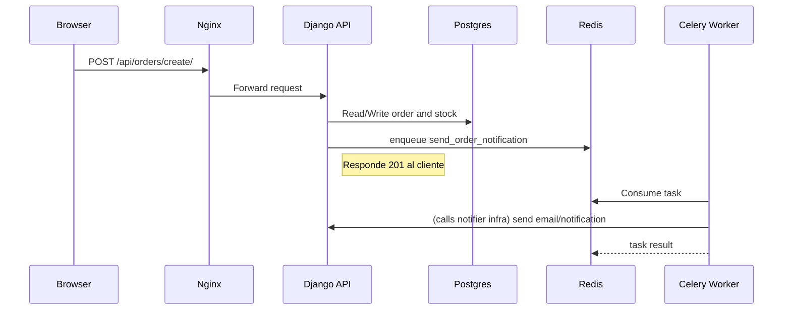

# QuickBite — Arquitectura, Despliegue y Diagrama (Entrega 2)

Este documento resume la arquitectura actual, el patrón Estrangulador aplicado, la orquestación con Docker Compose, y pasos mínimos para desplegar en AWS Academy (EC2 + Elastic IP). Incluye diagramas mermaid para ilustrar componentes y flujos.

**Resumen**
- Monolito Django (API + frontend) servido por `django`.
- Microservicio Flask: `services/restaurants` expone `/restaurants/` y es enrutado por Nginx (`/api/restaurants/`).
- Nginx actúa como API Gateway (ruteo y timeouts) en `nginx/nginx.conf`.
- Redis + Celery para procesamiento asíncrono (notificaciones, reportes).
- PostgreSQL como base de datos en `db`.
- Adapter para consumo de API de terceros (TheMealDB) en `orders/adapters/meal_adapter.py`.
- Nuevo: cliente aliado `orders/clients/ally_client.py` y endpoint `/api/ally/info/`.

**Diagrama: Arquitectura lógica (Mermaid)**

```mermaid
graph LR
  Client[Browser]
  Nginx[NGINX API Gateway]
  Django[Monolito Django]
  Flask[Microservicio Restaurants (Flask)]
  Postgres[(Postgres DB)]
  Redis[(Redis Broker)]
  Celery[Celery Worker]
  Ally[Servicio Aliado (3rd party)]

  Client -->|HTTP 80| Nginx
  Nginx -->|/api/restaurants/| Flask
  Nginx -->|/api/ & frontend| Django
  Django --> Postgres
  Flask --> Postgres
  Django --> Redis
  Django --> Celery
  Celery --> Redis
  Django -->|Consume| Ally
```

**Diagrama: Secuencia de creación de orden y notificación (Mermaid)**



**Requerimientos de Infraestructura (EC2 + Docker Compose)**

1. Provisionar una instancia EC2 (Ubuntu 22.04 recomendado) en AWS Academy.
2. Asignar una Elastic IP y abrir puertos `80` y `22` en el Security Group; si se necesita HTTPS abrir `443`.
3. Instalar `docker` y `docker-compose` en la instancia.
4. Clonar el repo y exportar variables de entorno mínimas (DB credentials pueden permanecer en compose para la práctica).

Comandos rápidos (en EC2):

```bash
sudo apt update && sudo apt install -y docker.io docker-compose
sudo usermod -aG docker $USER
logout && ssh back
git clone <REPO_URL> quickbite && cd quickbite
# (opcional) export ALLY_URL to point to the allied team's IP/API
docker compose up -d --build
```

Notas:
- Asegurar que la instancia tenga suficiente memoria para Postgres + Redis + Django + Flask + Celery. Para pruebas pequeñas 2 vCPU / 4GB RAM puede ser suficiente.
- Para producción: usar RDS, ElastiCache y ECS/EKS. Para la entrega es suficiente EC2 con Docker Compose.

**Qué se agregó en esta entrega (cambios relevantes)**
- `orders/clients/ally_client.py`: cliente HTTP para consumir servicio aliado con reintentos.
- `orders/views.py`: nuevo endpoint `AllyInfoAPIView` reexponiendo `/api/ally/info/`.
- `templates/partials/_nav.html`: placeholder `#ally-info` para mostrar el estado del aliado.
- `templates/base.html`: inyección de strings i18n en `I18N` para uso por JavaScript; función `loadAllyInfo()` que consulta `/api/ally/info/` y muestra el estado en la navegación.
- `README_ARCHITECTURE.md` (este archivo): diagramas y pasos de despliegue.
